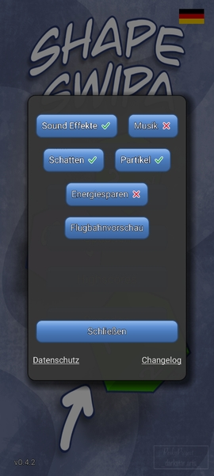
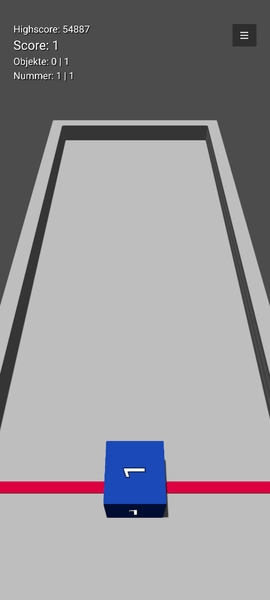
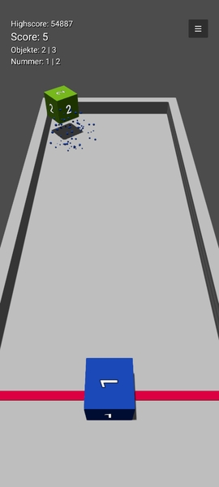
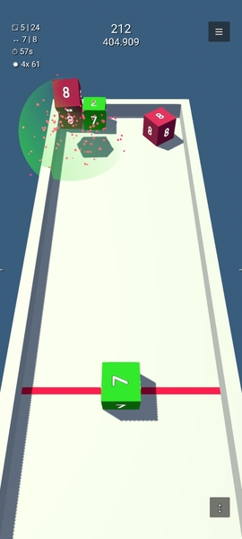
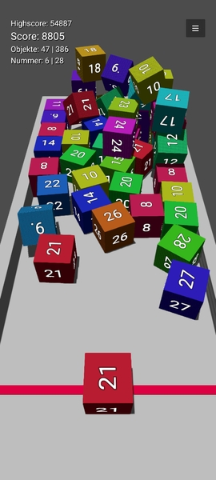
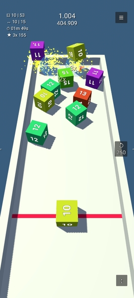
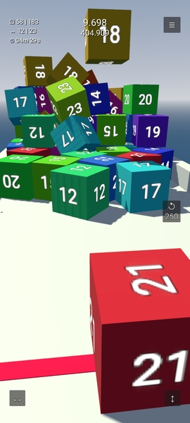
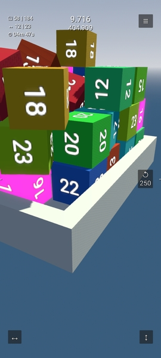
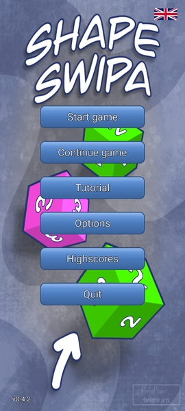
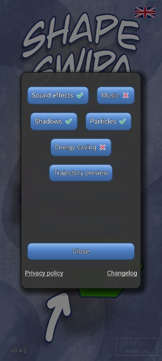

# Shape Swipa

## 🇩🇪 Deutsch

### Über das Spiel
**Shape Swipa** ist ein einfach zu erlernendes, aber kniffliges 3D-Physikspiel, entwickelt in **Godot 4.7** mit **GD-Script**.  
Das Spiel läuft ausschließlich im **Portrait-Modus** und nutzt die interne **Jolt-Physikengine**.

Du steuerst 3-Dimensionale Objekte, die auf einer **6,5 Meter langen** und **3 Meter breiten** Plattform liegen.  
Die Umgebung ist statisch, Wände sind halb so hoch wie die Objekte, mit unsichtbaren Barrieren nach oben, sodass nichts herunterfallen kann.  

### Es gibt 3 Unterschiedliche Objekte:  

#### Würfel:
- **0,5m³** groß
- **1 KG** Gewicht

#### Kugel:
- **0,25m** Radius
- **1 KG** Gewicht

#### Kapsel:
- **0,2m** Radius
- **0,8m** Höhe
- **1 KG** Gewicht

---

### Spielprinzip
1. **Startposition**  
   - Du beginnst mit einem einzelnen Gewicht mit der Zahl **1** auf jeder Seite.  
   - Jede Zahl besitzt eine eigene Farbe.
   - Die Farben unterscheiden sich deutlich, aber sobald mehr als 10 unterschiedliche Zahlen auf dem Spielfeld sind können die Farb- Differenzen enger beiander liegen.

2. **Bewegung**  
   - **Swipe (Wischen) nach vorne (oben)** → Objekt wird in Pfeilrichtung nach vorne geschleudert.  
   - **Swipe (Wischen) nach hinten (unten)** → Objekt springt nach vorne und kann andere Objekte überspringen.

3. **Kollisionen**  
   - Trifft dein Objekt auf einen anderen, explodiert dieser.
   - Die Zahl übrigen Objektes erhöht sich um **+1** und er bekommt eine neue Farbe.
   - Eine sichtbare Druckwelle gibt umliegenden Objekten einen Impuls, wodurch sie oft weggeschleudert werden. Der Impuls wird durch die Aufprallgeschwindigkeit beeinflusst.

4. **Neue Objekte**  
   - Zu Beginn des Spiels startet jedes neue Objekt mit der Zahl **1**.  
   - Im weiteren Spielverlauf wird die Zahl neuer Objekte zufällig zwischen der aktuell **kleinsten** und **größten** Zahl auf dem Spielfeld gewählt.  
     Beispiel: Min = 1 und Max = 5 → neues Objekt zwischen 1 und 5.  
     Min = 9 und Max = 15 → neues Objekt zwischen 9 und 15.  
     Die Berechnung begünstigt niedrige Zahlen leicht was aber nicht bedeutet, dass die Zahl erscheint die man gerade gut gebrauchen kann.

5. **Spielende**  
   - Unter der Startposition befindet sich eine rote Linie.  
   - Fällt ein Objekt darunter → **Game Over**.

---

### Spielmodus
- Aktuell gibt es nur den **Endlos-Modus** → Ziel ist es, den eigenen **Highscore** zu knacken.

---

### Screenshots

## 🚀 Interesse geweckt? Hier gibt es **Shape Swipa**!

### Google Play
[https://play.google.com/store/apps/details?id=com.zombai.dev.shape_swipa](https://play.google.com/store/apps/details?id=com.zombai.dev.shape_swipa)

### Itch.io
[https://zombai-dev.itch.io/shape-swipa](https://zombai-dev.itch.io/shape-swipa)

---
---

## 🇬🇧 English

### About the Game
**Shape Swipa** is an easy-to-learn but challenging 3D physics game developed in **Godot 4.7** using **GD-Script**.
The game runs exclusively in **portrait mode** and uses the built-in **Jolt physics engine**.

You control 3-dimensional objects that are placed on a platform that is **6.5 meters long** and **3 meters wide**.
The environment is static; walls are half as tall as the objects, with invisible barriers at the top so that nothing can fall off.

---

### There are 3 different objects:

#### Cube:
- **0.5 m³** in volume
- **1 kg** in weight

#### Sphere:
- **0.25 m** in radius
- **1 kg** in weight

#### Capsule:
- **0.2 m** in radius
- **0.8 m** in height
- **1 kg** in weight

---

### Gameplay
1. **Starting Position**
   - You start with a single weight with the number **1** on each side.
   - Each number has its own color.
   - The colors are clearly distinct, but once there are more than 10 different numbers on the playing field, the color differences may become less noticeable.

2. **Movement**
   - **Swipe forward (up)** → The object is launched forward in the direction of the arrow.
   - **Swipe backward (down)** → The object bounces forward and can jump over other objects.

3. **Collisions**
   - If your object hits another one, it explodes.
   - The number of the remaining object increases by **+1**, and it gets a new color.
   - A visible shockwave gives surrounding objects an impulse, often sending them flying. The impulse is influenced by the impact speed.

4. **New Objects**
   - At the start of the game, each new object begins with the number **1**.
   - As the game progresses, the number of new objects is randomly selected between the current **smallest** and **largest** numbers on the playing field.
     Example: Min = 1 and Max = 5 → new object between 1 and 5.
     Min = 9 and Max = 15 → new object between 9 and 15.
     The calculation slightly favors lower numbers, but that doesn’t mean the number you need right now will appear.

5. **Game Over**
   - There is a red line below the starting position.
   - If an object falls below it → **Game Over**.

---

### Game Mode
- Currently, only **Endless Mode** is available → The goal is to beat your own **high score**.

---

### Screenshots

## 🚀 Interested? You can find **Shape Swipa** here!

### Google Play
[https://play.google.com/store/apps/details?id=com.zombai.dev.shape_swipa](https://play.google.com/store/apps/details?id=com.zombai.dev.shape_swipa)

### Itch.io
[https://zombai-dev.itch.io/shape-swipa](https://zombai-dev.itch.io/shape-swipa)

---

## Datenschutz / Privacy
[https://zombai-dev.github.io/Shape-Swipa/privacy](https://zombai-dev.github.io/Shape-Swipa/privacy)

## Changelog
[https://zombai-dev.github.io/Shape-Swipa/changelog](https://zombai-dev.github.io/Shape-Swipa/changelog)

## Entwickler / Developer
**ZombAI-dev**  
📧 Kontakt / Contact: [zombai.dev@gmail.com]  
