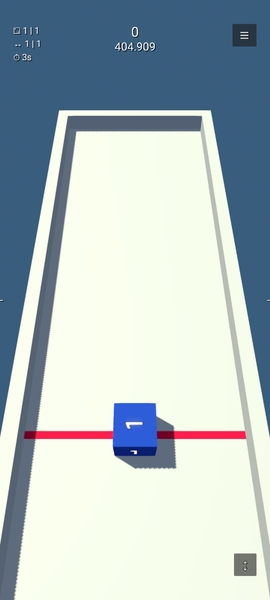

# Shape Swipa

## 🇩🇪 Deutsch

### Über das Spiel
**Shape Swipa** ist ein einfach zu erlernendes, aber kniffliges 3D-Physikspiel, entwickelt in **Godot 4.4** mit **GD-Script**.  
Das Spiel läuft ausschließlich im **Portrait-Modus** und nutzt die interne **Jolt-Physikengine**.

Du steuerst Würfel, die auf einer **6,5 Meter langen** und **3 Meter breiten** Plattform liegen.  
Die Umgebung ist statisch, Wände sind halb so hoch wie die Würfel, mit unsichtbaren Barrieren nach oben, sodass nichts herunterfallen kann.  
Die Würfel sind **0,5m³** groß.

---

### Spielprinzip
1. **Startposition**  
   - Du beginnst mit einem einzelnen Würfel mit der Zahl **1** auf jeder Seite.  
   - Jede Zahl besitzt eine eigene Farbe.

2. **Bewegung**  
   - **Swipe nach vorne (oben)** → Würfel wird in Pfeilrichtung nach vorne geschleudert.  
   - **Swipe nach hinten (unten)** → Würfel springt nach hinten und kann andere Würfel überspringen.

3. **Kollisionen**  
   - Trifft dein Würfel auf einen anderen, explodiert dieser.  
   - Die Zahl deines Würfels erhöht sich um **+1** und er bekommt eine neue Farbe.  
   - Eine unsichtbare Druckwelle gibt umliegenden Würfeln einen Impuls, wodurch sie oft weggeschleudert werden.

4. **Neue Würfel**  
   - Zu Beginn des Spiels startet jeder neue Würfel mit der Zahl **1**.  
   - Im weiteren Spielverlauf wird die Zahl neuer Würfel zufällig zwischen der aktuell **kleinsten** und **größten** Zahl auf dem Spielfeld gewählt.  
     Beispiel: Min = 1 und Max = 5 → neuer Würfel zwischen 1 und 5.  
     Min = 9 und Max = 15 → neuer Würfel zwischen 9 und 15.

5. **Spielende**  
   - Unter der Startposition befindet sich eine rote Linie.  
   - Fällt ein Würfel darunter → **Game Over**.

---

### Spielmodus
- Aktuell gibt es nur den **Endlos-Modus** → Ziel ist es, den eigenen **Highscore** zu knacken.
- Statistiken oben links:
  - Highscore
  - Aktueller Score
  - Anzahl Würfel auf dem Spielfeld
  - Gesamtanzahl aller Würfel
  - Min- und Max-Zahl der Würfel

---

### Screenshots

## 🚀 Werde Beta-Tester für **Shape Swipa**!

Möchtest du einen exklusiven Blick auf mein neues Spiel werfen?  
Die **Closed Beta** läuft, und du kannst dabei sein!

Da es eine geschlossene Beta ist, muss ich vorab deine E-Mail-Adresse als Tester eintragen.  

👉 Schreibe mir einfach eine Nachricht per E-Mail oder privat (siehe ganz unten auf der Seite), damit ich dich hinzufügen kann.

**Danach kannst du ganz einfach über den Weblink beitreten:**  
[https://play.google.com/apps/testing/com.zombai.dev.shape_swipa](https://play.google.com/apps/testing/com.zombai.dev.shape_swipa)

**So geht’s:**  
1. Ich trage deine E-Mail als Tester ein.  
2. Du klickst auf den Link und meldest dich mit deinem Google-Konto an.  
3. Klicke auf **„Tester werden“** und installiere das Spiel im Play Store.

💡 Als Tester bekommst du frühzeitigen Zugriff auf Updates und kannst mir direkt Feedback geben, um das Spiel zu verbessern.

---

## 🇬🇧 English

### About the Game
**Shape Swipa** is an easy-to-learn but tricky 3D physics game developed in **Godot 4.4** using **GD-Script**.  
The game runs exclusively in **portrait mode** and uses the built-in **Jolt physics engine**.

You control cubes placed on a **6.5 meter long** and **3 meter wide** platform.  
The environment is static, walls are half the cube's height, with invisible barriers above to prevent cubes from falling off.  
Each cube is **0.5m³** in size.

---

### Gameplay
1. **Starting Position**  
   - You start with a single cube showing the number **1** on all sides.  
   - Each number has its own color.

2. **Movement**  
   - **Swipe forward (up)** → Cube is launched forward in the arrow's direction.  
   - **Swipe backward (down)** → Cube jumps backward, allowing it to skip over other cubes.

3. **Collisions**  
   - If your cube hits another cube, that cube explodes.  
   - Your cube’s number increases by **+1** and gets a new color.  
   - An invisible shockwave pushes nearby cubes, often scattering them.

4. **New Cubes**  
   - At the start of the game, every new cube begins with the number **1**.  
   - As the game progresses, the number of new cubes is randomly chosen between the **lowest** and **highest** number currently on the field.  
     Example: Min = 1 and Max = 5 → cube between 1 and 5.  
     Min = 9 and Max = 15 → cube between 9 and 15.

5. **Game Over**  
   - Below the starting position is a red line.  
   - If a cube falls below it → **Game Over**.

---

### Game Mode
- Currently only **Endless Mode** → Goal is to beat your **high score**.
- Statistics displayed in the top left:
  - High score
  - Current score
  - Number of cubes on the field
  - Total number of cubes
  - Min and max cube numbers

---

### Screenshots

## 🚀 Become a Beta Tester for **Shape Swipa**!

Want to get an exclusive first look at my new game?  
The **Closed Beta** is now live, and you can join!

Since this is a closed beta, I need to add your email address in advance as a tester.  

👉 Just send me a message via email or privately (see contact details at the bottom of the page), so I can add you.

**After that, you can join easily using the web link:**  
[https://play.google.com/apps/testing/com.zombai.dev.shape_swipa](https://play.google.com/apps/testing/com.zombai.dev.shape_swipa)

**How it works:**  
1. I add your email as a tester.  
2. You click the link and sign in with your Google account.  
3. Click **"Become a Tester"** and install the game from the Play Store.

💡 As a tester, you’ll get early access to updates and can send me direct feedback to help improve the game.

---

## Datenschutz / Privacy
[https://zombai-dev.github.io/Shape-Swipa/privacy](https://zombai-dev.github.io/Shape-Swipa/privacy)

## Changelog
[https://zombai-dev.github.io/Shape-Swipa/changelog](https://zombai-dev.github.io/Shape-Swipa/changelog)

## Entwickler / Developer
**ZombAI-dev**  
📧 Kontakt / Contact: [zombai.dev@gmail.com]  
